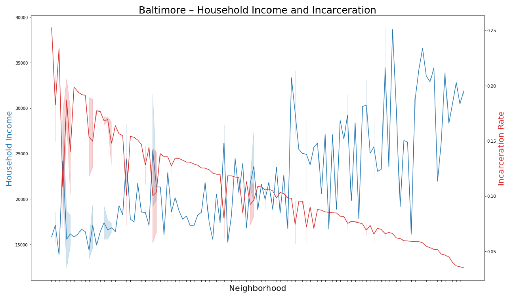
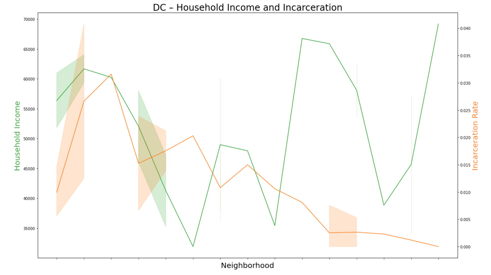

# Analyzing the Relationship Between Incarceration Rate and Household Income

## Background

Over the past few decades, America's prisoner population has skyrocketed to over [2.2 million inmates](https://www.prisonpolicy.org/reports/pie2020.html), the highest per capita imprisonment rate in the entire world. This trend of mass incarceration, which began in the 1970s, has disprortionately affected poor, black communities such as the Fairfield Area in Baltimore, and the housing projects of Southeast D.C. Many of these areas already face the obstacles of an underprivileged schooling system and high-risk neighborhoods - higher incarceration rates serve to further perpetuate the lack of social mobility experienced by these communities.

The cities of Baltimore, Maryland and Washington, D.C. present similar examples of underprivileged, metropolitan communities. Using data provided by [The Opportunity Atlas](https://www.opportunityatlas.org/), this project will analyze the relationship between incarceration rates and household incomes in different areas in both cities, and compare the resulting data. In particular, I'll be examining whether the expected negative relationship is visibile in the data, and if there are any noticable similarities or differences between the two analyzed cities.

I chose to examine this particular metric because I recently finished Michelle Alexander's _The New Jim Crow_, which provides a detailed recount of the caste-like imprisonment system instituted by the U.S. Government over the last few decades. My hometown is technically Potomac, MD, but the data from my area wasn't significant enough to compare with Baltimore, so I decided to use D.C. instead since I only live 15 minutes away.

## Business Question
What is the relationship between incarceration rates and household incomes in Baltimore and D.C., and how does the data from the two cities compare? What does this information tell us about the characteristics of these two cities?

## Data Question - Open Data

All of the data used in this project was gathered from [The Opportunity Atlas](https://www.opportunityatlas.org/).
The original data files can be found in the repository [here](https://github.com/a31kim/python-dc-balti-incarceration-income/tree/main/original%20datasets).

1. [balti_jail](https://github.com/a31kim/python-dc-balti-incarceration-income/blob/main/original%20datasets/balti_jail.csv) contains the data for incarceration rates in various communities within Baltimore city.
2. [balti_income](https://github.com/a31kim/python-dc-balti-incarceration-income/blob/main/original%20datasets/balti_income.csv) contains the data for average household incomes in various communities within Batlimore city.
3. [dc_jail](https://github.com/a31kim/python-dc-balti-incarceration-income/blob/main/original%20datasets/dc_jail.csv) contains the data for incarceration rates in various communities within Washington, D.C.
4. [dc_income](https://github.com/a31kim/python-dc-balti-incarceration-income/blob/main/original%20datasets/dc_income.csv) contains the data for average household incomes in various communities within Washington, D.C.

## Data Question - Analysis

Python (Google Colaboratory Notebooks) was used to answer:
* **What is the relationship between household income and incarceration rates in Baltimore and D.C.?** Cleaning the data to effectively merge the incarceration and household income data into an aggregate chart
* **Do Baltimore and D.C. demonstrate similar characteristics regarding the income/incarceration relationship?** Comparing the data between the two cities to determine if there is a noticable difference between the two

## Data Answer

I chose to summarize my anaylsis with a combination graph that displays the relationship between both metrics. I imported matplot and seaborn into my Python notebook in order to create these graphics.

#### Baltimore, MD Graph

This combination graph clearly shows a negative relationship between incarceration rates and household income. As incarceration rates decrease (red), household income (blue) noticeably trends upwards. I removed the labels from the x-axis, since it was illegible due to font overlap. The full dataset used to generate this graph can be found in my Google Colaboratory Notebook.

Examples of the statistical relationship described above:
* Greenmount West face incarceration rates as high as 25%, with household incomes barely reaching $15,000
* Comparatively, Mount Washington experiences incarceration rates as low as 0.05%, while benefitting from household incomes in the range of $70,000 a year

#### Washington, D.C. Graph

This combination graph displays a similarly negative relationship between incarceration rates and household income. Once again, as incarceration rates decrease (orange), household income (green) follows an upwards trend. I removed the labels from this x-axis as well, due to the same reasons (font overlap, illegibility) as the Baltimore graph.

Examples of the statistical relationship described above:
* Georgetown and the Naval Observatory have significantly higher incomes and much lower incarceration rates than areas like Barry Farm and the Capitol Riverfront.

## Data Application

The data analysis presented in this project adequately demonstrates the widely assumed negative relationship between household income and incarceration rates. The data does not seem to indicate any difference between Baltimore and D.C. in this regard, as the cities displayed very similar relationships. Upon researching some of the more prominent examples, such as those mentioned above, the vast majority of the low-income, high-incarceration communities were in low-educated, underprivileged areas. This is not particularly surprising, but the direct correlation is very interesting in regards to the issue of social mobility and community betterment.

It may have been helpful to have some additional data on the number of crimes committed annually in each area, to get a sense of the relative risk in each community as context for the incarceration data. It would also be interesting to compare this data with the relative primary/secondary education opportunities provided in each area.

As a resident of both cities, I think that it's important to remain cognizant of the entire city's populace, rather than just focusing on your own little bubble. Being a college student in Baltimore is a unique privilege, and analyzing data like this is a reminder of how amazing and rare an opportunity like this is.

